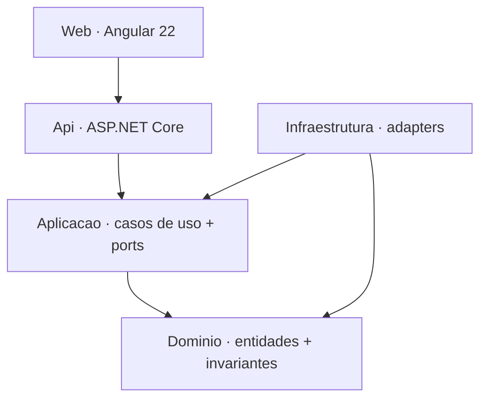
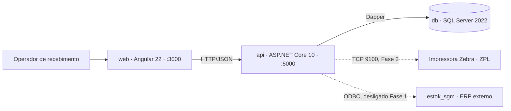
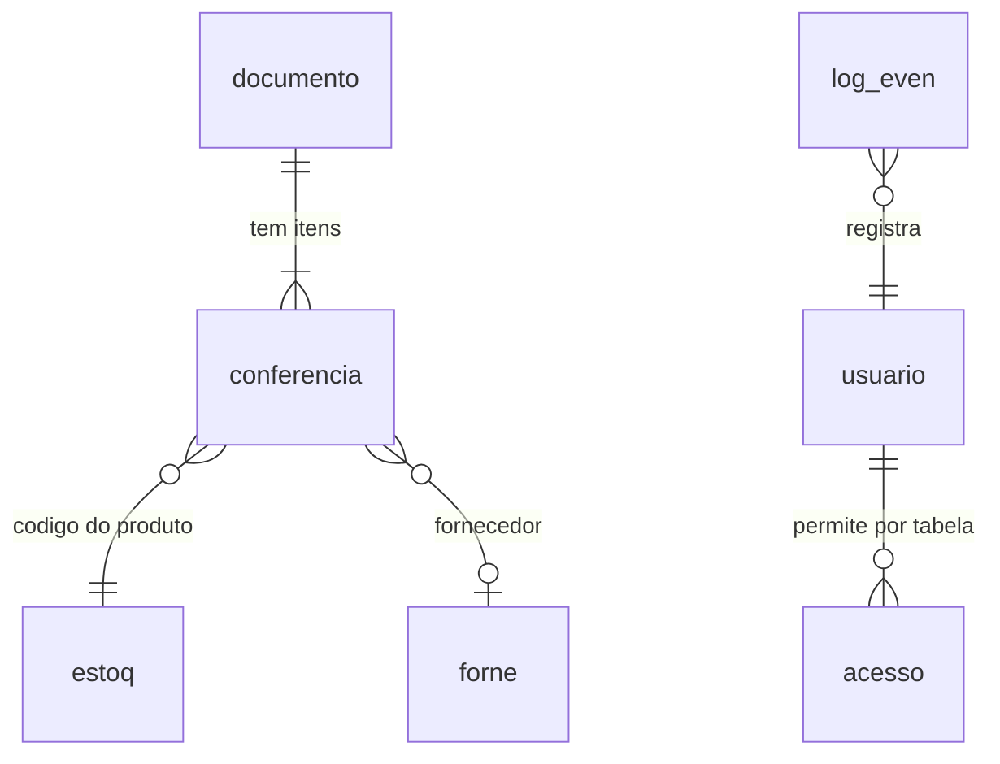

# Architecture Spine — Mundial - Conferência

## Design Paradigm

**Ports & Adapters (hexagonal)** com fatias verticais por caso de uso.

O legado é uma tela de FoxPro onde regra, SQL e UI vivem no mesmo `.Valid`. O paradigma existe
para separar isso de vez: as 70 regras recuperadas viram código de domínio testável sem banco,
e o SQL passthrough do legado vira adapter substituível.

| Camada | Namespace | Contém |
| --- | --- | --- |
| Domínio | `Mundial.Dominio` | entidades, value objects, invariantes (`DOMAIN_INVARIANT`) |
| Aplicação | `Mundial.Aplicacao` | casos de uso, ports, validações (`APPLICATION_VALIDATION`, `VALIDATION`) |
| Infraestrutura | `Mundial.Infraestrutura` | adapters Dapper, ZPL, ODBC, hashing |
| API | `Mundial.Api` | endpoints HTTP, autenticação, contrato de erro |
| Web | `mundial-web` | Angular 22 standalone |

## Invariants & Rules



Setas apontam para dentro. `Dominio` não referencia ninguém. `Infraestrutura` implementa ports
declarados em `Aplicacao` — nunca o contrário.

### AD-1 — Ports & Adapters com dependências apontando para dentro

- **Binds:** todo o backend
- **Prevents:** regra de negócio vazando para controller ou para string SQL, como no legado
- **Rule:** `Mundial.Dominio` não tem referência de projeto para nenhum outro. `Mundial.Aplicacao` referencia só `Dominio`. `Infraestrutura` e `Api` referenciam para dentro. Toda dependência externa (banco, impressora, ODBC, relógio) entra como interface `I*Port` declarada em `Aplicacao`.

### AD-2 — Identidade dupla: surrogate para a API, chave natural preservada

- **Binds:** `conferencia`, `estoq`, `usuario`, `acesso`, `forne`
- **Prevents:** perda da identidade de negócio do legado. `conferencia` tem PK composta de 6 colunas no UIR (`filial`, `orig_des`, `tipo_doc`, `SERIE`, `numero`, `codigo`); o pacote BMAD original a substituiu por `id` autoincrement e **descartou as 6 colunas**, tornando impossível achar uma conferência pelo documento fiscal — que é exatamente como o operador trabalha.
- **Rule:** toda tabela ganha `id INT IDENTITY PRIMARY KEY` para servir as rotas REST, **e** mantém a chave natural do UIR como `UNIQUE NOT NULL`. Busca por chave natural é endpoint de primeira classe, não filtro opcional.

### AD-3 — O UIR é a autoridade do schema; campo de tela não é coluna

- **Binds:** schema, migrations DbUp, DTOs, formulários Angular
- **Prevents:** colunas fantasma. O pacote original criou `dataenvironment`, `timer1`, `listnf`, `listprod`, `contem`, `qtde`, `ean13`, `codigo1` como colunas — são controles de form do Visual FoxPro (`DataEnvironment`, `Timer`, `ListBox`), não dado persistido.
- **Rule:** nome de tabela e de coluna vêm da fonte legada, sem renomear e sem acrescentar. Campo que existe em `ui.screens[].fields[]` mas não no schema é estado de tela e vive no componente Angular.
- **Ordem de autoridade** (a de cima vence): **1.** o DDL SQL Server retido em `database/SQL Scripts/` para `acesso`, `conferencia`, `forne`, `usuario`; **2.** `estoq_structure.TXT` para `estoq`; **3.** `reg_log` em `conferencia.PRG` para `log_even`; **4.** `getErModel` do MCP para o que nenhuma das anteriores cobre. O `getErModel` é o **último** recurso — provou-se incompleto: devolve 6 das 116 colunas de `estoq`, todas com tipo `UNKNOWN`, e `log_even` sem coluna alguma.
- **Exceções, e só estas três:**
  1. **Segurança vence fidelidade.** Onde AD-7 exige, o nome muda (`senha` → `senha_hash`). Nenhuma outra razão autoriza renomear.
  2. **Colunas de infraestrutura** que o AD-2 e o AD-17 exigem — `id` surrogate e `rowversion` — são adições autorizadas. Não carregam significado de negócio e nenhuma regra `RK-…` as toca. Qualquer outra coluna nova é violação.
  3. **Coluna citada por regra mas ausente da fonte** entra marcada com o `ruleKey` que a exige, e o par vira questão em aberto. Nenhum caso conhecido hoje — `estoq.barr_emb3` era o candidato e foi confirmado na fonte como `Character(14)`.

### AD-4 — `dataBindings` é a autoridade do mapeamento label → coluna

- **Binds:** formulários Angular, DTOs, o contrato de UX produzido por `bmad-ux` (o antigo `docs/ux/DESIGN.md` estava errado e foi movido para `docs/historico-rnc/`)
- **Prevents:** gravar dado na coluna errada. O campo rotulado **"Código Ean 13:"** grava em `conferencia.dun14`, e existe *outro* campo chamado `ean13` na mesma tela. O campo rotulado **"Documento"** grava em `conferencia.acesso`.
- **Rule:** todo campo de formulário declara label exibido e coluna de destino separadamente, conforme `dataBindings` do UIR. Nunca inferir a coluna a partir do label.

| Campo de tela | Label | Coluna | Limite |
| --- | --- | --- | --- |
| `rec_nf.documento` | Documento | `conferencia.acesso` | 25 |
| `rec_nf.codigo` | Código Ean 13: | `conferencia.dun14` | 14 |
| `rec_nf.doca` | Doca | `conferencia.doca` | — |
| `log_conf.senha3` | Senha3 | `usuario.senha_hash` (via AD-7 — nunca comparação direta) | — |

### AD-5 — Toda regra implementada cita seu `ruleKey`

- **Binds:** as 70 regras do UIR
- **Prevents:** regra perdida, duplicada ou reinventada; impossibilidade de auditar o que foi migrado
- **Rule:** cada regra vira um método nomeado com `[RegraNegocio("RK-<12hex>")]`. Antes de fechar uma story, `getRule(workspaceId, ruleKey)` confirma condição e trecho de origem. Uma regra sem `ruleKey` no código não conta como migrada.

### AD-6 — Regra vai para a camada que o `candidateType` indica

- **Binds:** as 70 regras
- **Prevents:** 16 das 70 regras virarem validação de API por engano — 7 são montagem de etiqueta ZPL (`^XA`, `^FO`, `^BCR`, `^XZ`) e 9 são diálogo de confirmação `MessageBox`. Nenhuma das duas é invariante de servidor.
- **Rule:**

| Origem no UIR | Destino | Qtd |
| --- | --- | --- |
| `DOMAIN_INVARIANT` | `Mundial.Dominio` | 19 |
| `APPLICATION_VALIDATION` | `Mundial.Aplicacao` | 29 |
| `VALIDATION` | `Mundial.Aplicacao` (validador de entrada) | 22 |
| condição com `messagebox(...)` | confirmação na UI Angular | 9 |
| condição com `^XA`/`^FO`/`^XZ` | `Mundial.Infraestrutura.Etiquetas` | 7 |

  As últimas duas linhas se sobrepõem às três primeiras: a classificação por conteúdo vence a
  do `candidateType`. Uma confirmação de UI **nunca** bloqueia no servidor.

### AD-7 — Senha nunca em claro; senha legada não migra

- **Binds:** `usuario`, autenticação
- **Prevents:** replicar os 3 achados `CLEARTEXT_PASSWORD` (HIGH) do UIR. O legado compara `This.Value#senha` contra `usuario.senha VARCHAR` em texto puro.
- **Rule:** `usuario.senha` recebe hash via `PasswordHasher<T>` do ASP.NET Core Identity e é renomeada para `senha_hash`. Nenhum valor de senha do legado é importado — todo usuário migrado entra com reset obrigatório no primeiro acesso. Campo de senha nunca aparece em log, resposta de API ou mensagem de erro.

### AD-8 — Permissão vem de `acesso`, por **tabela**, via policy

- **Binds:** todo endpoint, toda rota Angular
- **Prevents:** cada tela inventando seu próprio controle de acesso, ou permissão só no frontend. E o erro que este AD já cometeu: tratar `arquivo` como identificador de **tela**, o que faria uma tela que lê duas tabelas exigir uma permissão só.
- **Rule:** `acesso(matric, arquivo)` com as flags `alterar`, `incluir`, `excluir`, `consultar` vira policy-based authorization. **`arquivo` é o nome da tabela** (`char(10)`) — confirmado no `readme.txt` do cliente e no DDL. Como `conferencia` tem 11 caracteres e não cabe, a chave de permissão é o nome **truncado em 10** (ver F-9 e Q-10). Uma tela que toca N tabelas exige as N permissões correspondentes. A policy é aplicada no endpoint (autoridade) e espelhada na rota Angular (conveniência). Ausência de linha em `acesso` = negado.

### AD-9 — Dapper com SQL explícito; migrations em DbUp

- **Binds:** `Mundial.Infraestrutura`
- **Prevents:** dois estilos de acesso a dado convivendo; schema divergindo entre ambientes
- **Rule:** um repositório por agregado, SQL literal em arquivo `.sql` embutido como recurso — sem query builder, sem change tracking. Toda mudança de schema é um script DbUp numerado, executado exatamente uma vez, versionado no git. Nenhum `CREATE`/`ALTER` fora do DbUp.

### AD-10 — O **documento** é o agregado; finalizar é transição atômica

- **Binds:** fluxo de conferência de recebimento
- **Prevents:** conferência meio-fechada; dois caminhos mutando o mesmo estado. E a leitura errada de que uma linha de `conferencia` é uma conferência inteira — a PK inclui `codigo` (o produto), então **cada linha é um item da nota**.
- **Rule:** o agregado é o **documento**, identificado por `filial + orig_des + tipo_doc + SERIE + numero`. Suas linhas são os itens, uma por `codigo`. `fechado`, `matr_fec`, `dt_hora` e `situacao` só mudam dentro de `FinalizarDocumento`, em transação única, **em todas as linhas do documento de uma vez**. Lançamento de item só é aceito enquanto o documento tem `fechado = 0`. Nenhum endpoint de CRUD genérico escreve nesses quatro campos.
- **Nota:** o sistema **nunca cria** linha de `conferencia`. Elas nascem da integração da nota fiscal, antes da conferência começar, com `qtd_nf` já preenchida. O operador só preenche `qtd_rec`.

### AD-11 — Contrato de erro RFC 9457 com `ruleKey`

- **Binds:** toda a API
- **Prevents:** cada endpoint inventando seu formato de erro; frontend sem saber qual regra disparou
- **Rule:** todo erro sai como `application/problem+json` (RFC 9457). Erro originado de regra carrega a extensão `ruleKey` e a mensagem original em pt-BR do legado.

### AD-12 — Idioma: legado no schema, português no domínio e na UI

- **Binds:** todo o código
- **Prevents:** metade do sistema em inglês e metade em português — a falha mais provável quando a diretiva diz "tudo em pt-BR" mas o schema legado é abreviado
- **Rule:** nome de tabela e coluna preservam o legado exatamente (`conferencia`, `barr_emb`, `qtd_rec`). Tipos, casos de uso e rotas em português (`Conferencia`, `FinalizarConferencia`, `/conferencias`). Toda mensagem ao usuário em pt-BR, reaproveitando o texto original do legado quando existe.

### AD-13 — Angular 22 standalone, sem NgModules

- **Binds:** `mundial-web`
- **Prevents:** mistura de estilo NgModule/standalone dentro do mesmo app
- **Rule:** componentes standalone, estado local com signals, `provideHttpClient` na bootstrap. Um feature folder por entidade, mais um dedicado ao fluxo de conferência. Nenhum `NgModule` novo.

### AD-14 — `estok_sgm` é o próprio banco; a integração externa é a nota fiscal

- **Binds:** origem do dado de `conferencia`
- **Prevents:** construir anticorruption layer contra um sistema que não existe, e — o oposto — supor que o sistema cria conferência do nada
- **Rule:** `estok_sgm` é a conexão ODBC do FoxPro com o **próprio banco `sgm`**, onde `acesso`, `conferencia`, `forne` e `usuario` já vivem em SQL Server. Não há ERP externo a isolar; as duas regras de erro ODBC não têm equivalente na aplicação nova. A integração real é outra: **as linhas de `conferencia` chegam prontas da integração da nota fiscal**, fora deste sistema. Modelamos essa origem como um port de entrada de dado (`IIntegracaoNotaFiscalPort`), servido no POC pelo seeder do AD-21. Nenhum caminho da aplicação cria linha de `conferencia`.
- **Nota:** só `estoq` continua em DBF, num share de rede (`\\10.1.1.9\estoq200`). A migração é SQL→SQL para quatro tabelas com o DDL de origem em mãos, e DBF→SQL apenas para `estoq`.

### AD-15 — Contrato único de listagem

- **Binds:** todo endpoint `GET` de coleção, todo cliente HTTP Angular
- **Prevents:** cada entidade paginando do seu jeito (`page`/`size` vs `pageNumber`/`pageSize`, envelope vs header), obrigando o frontend a manter um cliente por recurso
- **Rule:** `GET /api/<recurso>?pagina=0&tamanho=50&busca=<termo>&ordem=<campo>:<asc|desc>`. Resposta sempre `{ "itens": [...], "total": n, "pagina": p, "tamanho": t }`. `tamanho` default 50, máximo 200. `busca` aplica sobre as colunas de lista declaradas na story da entidade.

### AD-16 — Um dono de escrita por tabela

- **Binds:** `conferencia`, `estoq`, `usuario`, `acesso`, `forne`
- **Prevents:** dois slices escrevendo na mesma tabela — o fluxo de conferência lê `estoq` para resolver DUN-14 enquanto o cadastro DUN-14 escreve nela; sem dono declarado, cada um cria seu repositório e as regras de unicidade de código de barras valem só de um lado
- **Rule:** cada tabela tem exatamente um agregado dono, e só ele escreve. Outros slices leem por um port de consulta read-only.

| Tabela | Dono de escrita | Quem só lê |
| --- | --- | --- |
| `conferencia` | `Conferencia` | — |
| `estoq` | `Estoq` (cadastro DUN-14) | fluxo de conferência |
| `usuario`, `acesso` | `Autenticacao` | todo endpoint (via policy) |
| `forne` | `Forne` | fluxo de conferência |
| `log_even` | `Auditoria` (append-only) | — |

### AD-17 — Quantidade **substitui** com confirmação; concorrência é otimista

- **Binds:** fluxo de conferência
- **Prevents:** dois operadores no mesmo documento com last-write-wins silencioso, e a divergência entre uma implementação que faz `SET qtd_rec = @valor` e outra que faz `SET qtd_rec = qtd_rec + @valor`. Mesmos cliques, resultados diferentes.
- **Rule:** lançamento **substitui** (`qtd_rec = @quantidade`). Quando `qtd_rec > 0`, a substituição exige confirmação explícita do operador antes de gravar (`RK-8233e231d6fb`, `RK-5960908935ee`); recusa aborta sem gravar. `conferencia` ganha coluna `rowversion`; todo `UPDATE` compara a versão e devolve `409 Conflict` com `problem+json` quando não bate.
- **Base da decisão:** `qtd_rec` é campo escalar de um item de nota com `qtd_nf` já preenchido, não há tabela de lançamentos onde acumular, e o aviso só protege alguma coisa se a ação for destrutiva — somar não precisaria de confirmação. Fonte binária não permite prova direta; ver Q-1. Se a Mundial confirmar acúmulo, este AD e o FR-18 mudam juntos.

### AD-18 — Servidor é a autoridade; cliente é espelho declarado

- **Binds:** as 51 regras de validação, formulários Angular
- **Prevents:** ou nenhuma validação no cliente (o operador bipa 40 itens e só descobre o erro no fim), ou reimplementação em TypeScript que sai de sincronia com a versão C# na primeira mudança
- **Rule:** toda validação existe no servidor, sem exceção. O cliente só espelha regras de forma (obrigatório, tamanho, formato) geradas a partir do mesmo contrato. Regra que depende de consulta ao banco (`_tally > 0`, `Reccount() = 0`) **nunca** é reimplementada no cliente — vira chamada de verificação ao servidor.

### AD-19 — Fuso: instante em UTC, exibição no fuso do armazém

- **Binds:** `dt_hora`, `data_conf`, `data_mov`, `data_valid`
- **Prevents:** metade do sistema gravando `DateTime.UtcNow` e a outra metade hora local — uma conferência fechada às 23h30 aparece no dia seguinte para parte do sistema
- **Rule:** o banco guarda `DATETIME2` em UTC. A API troca ISO-8601 com sufixo `Z`. A exibição converte para `America/Sao_Paulo`, configurável por `TZ_APLICACAO`. Nenhum `DateTime.Now` no código — só o port `IRelogio`.

### AD-20 — Teste prova equivalência regra a regra

- **Binds:** as 70 regras, todos os slices
- **Prevents:** cobertura impossível de auditar — sem contrato, uma unidade entrega regra sem teste e outra monta E2E, e ninguém consegue responder "quais das 70 regras já estão migradas?"
- **Rule:** toda regra com `[RegraNegocio("RK-…")]` tem ao menos um teste que cita o mesmo `ruleKey` no nome. Domínio testa sem banco. Cada caso de uso tem teste de integração contra SQL Server em container. O fluxo de conferência tem um E2E do caminho feliz (login → bipar → lançar → finalizar). Um relatório de rastreabilidade `ruleKey → teste` é gerado a cada build.

### AD-21 — O andaime de demonstração é removível por construção

- **Binds:** seed, reset da demo, painel de códigos, painel de docas
- **Prevents:** seed espalhado entre migration DbUp e endpoint de API, e domínio passando a depender de dado semeado — o que transforma "remover o andaime" em refatoração em vez de deletar uma pasta
- **Rule:** todo o andaime vive em `Mundial.Demo`, um projeto separado que **referencia** `Aplicacao` e nunca é referenciado por ninguém. Registra-se apenas quando `MODO_DEMO=true`. O seed **não** entra em migration DbUp — migration é schema, seed é dado de demonstração. Nenhum tipo de `Dominio` ou `Aplicacao` conhece `Mundial.Demo`; apagar o projeto e a flag deixa a solução compilando.
- **Corolário:** o painel de docas consome os mesmos endpoints de leitura que o produto usa. Se precisar de endpoint próprio, ele nasce em `Api`, não em `Demo` — a tela é andaime, o dado que ela lê não é.

## Consistency Conventions

| Concern | Convention |
| --- | --- |
| Nomes de tabela/coluna | idênticos ao `getErModel` do UIR — minúsculo, abreviação legada preservada |
| Nomes de tipo/caso de uso | PascalCase em português sem acento (`Conferencia`, `FinalizarConferencia`) |
| Rotas HTTP | ``/api/<entidade-plural>`` em minúsculo (`/api/conferencias`) |
| Ports | interface `I{Nome}Port` em `Aplicacao`, implementação `{Nome}Adapter` em `Infraestrutura` |
| Regra de negócio | método com `[RegraNegocio("RK-…")]`; nome do método descreve a condição |
| Id | `id` surrogate na API; chave natural em rota dedicada de busca |
| Data/hora | `DATETIME2` no banco, ISO-8601 UTC no JSON, exibição `dd/MM/yyyy HH:mm` |
| Decimal | `DECIMAL(18,4)` no banco, `number` no JSON — nunca `float` para quantidade |
| Erro | `application/problem+json` (RFC 9457) + extensão `ruleKey` |
| Log | estruturado, sem senha, sem CGC, sem número de documento completo |
| Config | `.env` + `.env.example`; conexão e segredo nunca no código |
| Auth | JWT emitido pela API; permissão sempre revalidada no servidor |
| Migration | script DbUp numerado `NNNN_descricao.sql`, SQL literal |

## Stack

| Name | Version |
| --- | --- |
| .NET | 10.0 (LTS, suporte até 14/11/2028) |
| ASP.NET Core | 10.0 |
| C# | 14 |
| Dapper | 2.1.79 |
| dbup-sqlserver | 7.2.0 |
| FluentValidation | 12.1.1 |
| Microsoft.Data.SqlClient | 7.0.2 |
| Angular | 22.1.x |
| TypeScript | 6.x (Angular 22 não aceita 5.9 ou anterior) |
| Node.js | 24 LTS (Active LTS; 22 já é Maintenance) |
| SQL Server | 2022 (`mcr.microsoft.com/mssql/server:2022-latest`) |
| Docker Compose | v2 |

## Structural Seed

### Contexto e containers



### Modelo de entidades



`documento` não é tabela — é o agregado do AD-10, as cinco primeiras colunas da PK de `conferencia`.
Cada linha de `conferencia` é um item da nota, chaveada também por `codigo`.

### Tipos vindos da fonte legada

Larguras que o `getErModel` não devolvia. São contrato, não sugestão — código de barras com um
caractere a mais deixa de casar.

| Coluna | Tipo | Origem |
| --- | --- | --- |
| `estoq.CODIGO`, `conferencia.codigo` | `char(5)` | DDL + `estoq_structure.TXT` |
| `estoq.CODBARR`, `CODBARR2`, `CODBARR3` | `char(13)` — EAN-13 | `estoq_structure.TXT` |
| `estoq.BARR_EMB`, `BARR_EMB2`, `BARR_EMB3` | `char(14)` — DUN-14 | `estoq_structure.TXT` |
| `estoq.EMBALAG` / `EMBALQT` | `char(10)` / `numeric(9,4)` | `estoq_structure.TXT` |
| `conferencia.dun14` | `char(14)`, default `''` | DDL |
| `conferencia.acesso` (documento) | `char(25)` | DDL |
| `conferencia.QTD_*` | `decimal(10,3)`, default 0 | DDL |
| `conferencia.situacao` | `char(1)`, default `' '` | DDL |
| `usuario.senha` | `char(6)` — vira `senha_hash` por AD-7 | DDL |
| `acesso.arquivo` | `char(10)` — nome de tabela | DDL |
| `log_even` | `data_eve`, `chave`, `arquivo`, `val_ant`, `val_atu`, `usuario` | `reg_log` em `conferencia.PRG` |

### Árvore de origem

```text
poc-mundial/
  src/
    Mundial.Dominio/           # entidades, value objects, DOMAIN_INVARIANT (19 regras)
    Mundial.Aplicacao/         # casos de uso, ports, validações (51 regras)
    Mundial.Infraestrutura/    # adapters Dapper, ZPL, ODBC, hashing
      Sql/                     # SQL literal por repositório (embedded resource)
      Etiquetas/               # montagem ZPL (7 regras)
    Mundial.Api/               # endpoints, auth, problem+json
    Mundial.Migrations/        # DbUp — scripts NNNN_*.sql (schema; nunca seed)
    Mundial.Demo/              # andaime: seed, reset, códigos à mão (AD-21)
  web/                         # Angular 22 standalone
    src/app/docas/             # painel de docas — andaime (AD-21)
    src/app/conferencia/       # fluxo operacional de recebimento
    src/app/cadastros/         # estoq, forne, usuario, acesso
  tests/
  docker-compose.yml
  .env.example
```

### Ambientes

| Ambiente | Como sobe | Banco |
| --- | --- | --- |
| dev local | `docker compose up --build` | container SQL Server, volume nomeado |
| POC/demo | mesmo compose, `.env` próprio | mesmo container |

Serviços se referenciam por nome (`api`, `db`) — nunca `localhost`. CORS libera só a origem do
frontend. O volume do banco é nomeado, então o dado sobrevive a `docker compose down`.

## Capability → Architecture Map

| Capability / Área | Lives in | Governed by |
| --- | --- | --- |
| Fluxo de conferência de recebimento | `Aplicacao/Conferencia`, `web/conferencia` | AD-1, AD-4, AD-6, AD-10, AD-16, AD-17, AD-19 |
| Cadastro DUN-14 / embalagem | `Aplicacao/Estoq`, `web/cadastros/estoq` | AD-3, AD-5, AD-15, AD-16 |
| Login e sessão | `Aplicacao/Autenticacao`, `Api/Auth` | AD-7, AD-8, AD-16 |
| Permissão por tela | `Api` (policies), `web` (guards) | AD-8, AD-18 |
| Fornecedor (lookup) | `Aplicacao/Forne` | AD-2, AD-3, AD-15 |
| Auditoria | `Infraestrutura/Auditoria` | AD-9, AD-16, AD-19 |
| Impressão de etiqueta | `Infraestrutura/Etiquetas` | AD-6, AD-14 |
| Schema e migração | `Mundial.Migrations` | AD-2, AD-3, AD-9 |
| Verificação de equivalência | `tests/` | AD-5, AD-20 |
| Andaime de demonstração | `Mundial.Demo`, `web/docas` | AD-21 |

## Deferred

| Adiado | Por que pode esperar | Revisitar quando |
| --- | --- | --- |
| Migração de dado do legado (DBF → SQL Server) | Fora de escopo declarado no product brief. Precisa de janela de corte e validação com o cliente. | Fase 1 aceita e cliente definir a janela |
| Integração ODBC `estok_sgm` | `logicOpaque: true` no UIR — o RNC não recuperou a lógica. Ligar sem mapear é apostar. | Alguém com acesso ao ERP documentar o contrato |
| Transporte físico da etiqueta ZPL | Depende de hardware Zebra. A montagem da string (7 regras) entra na Fase 1; o envio, não. | Impressora disponível para teste |
| Tabela `entrada` e módulo `esco_imp` | 5 `SQL_PASSTHROUGH` no UIR apontam para fora do escopo mapeado. | Escopo de integração com ERP for definido |
| Colunas de `log_even` | UIR retornou 0 colunas. Schema novo, não recuperado. | Requisito de auditoria for especificado |
| Tipos das colunas de `estoq` | `getErModel` devolve `UNKNOWN` para as 6 colunas. | Inspeção do DBF ou confirmação do cliente |
| SSO | Canvas RNC define `SSO: off`. | Cliente pedir |
| Observabilidade (métricas, tracing) | POC. Log estruturado já resolve o necessário agora. | Antes de produção |
| Estratégia de deploy além do compose | POC roda em compose. Cloud/K8s é outra decisão. | Existir ambiente de produção definido |
| Backup e restore do banco | Volume nomeado basta para POC; política de retenção é decisão do cliente. | Antes de qualquer dado real entrar |
| Degradação com banco ou impressora fora do ar | POC assume ambiente estável. Conferência em armazém com rede instável muda o desenho (fila local, retomada). | Piloto em armazém real |
| SQL Server 2025 | 2025 chegou a GA em 18/11/2025, mas nada no spine usa recurso exclusivo dele. Trocar é uma linha no compose. | Cliente padronizar 2025 |
